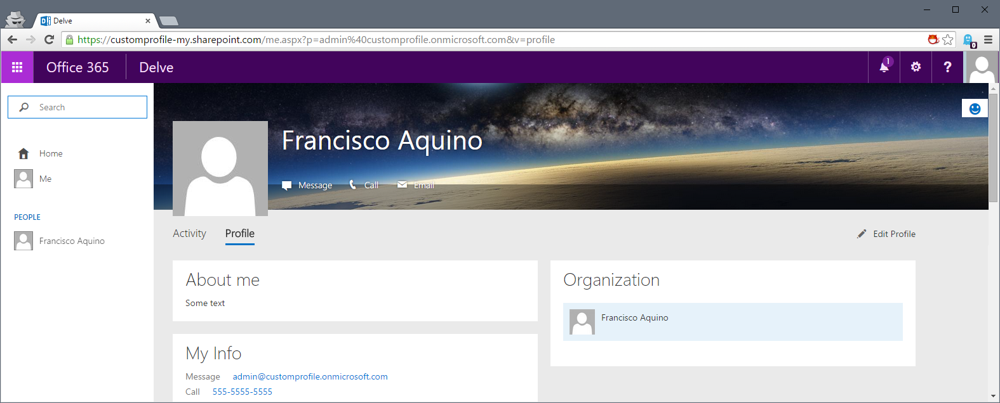

Customize Delve (Office 365)
==

Recently the Office 365 User Profile host has been replaced with the new profile tab inside Delve (if you have the Office Graph enabled). This solution allows you to either replace the Delve Profile with a fully custom built, or make small changes to a copy of Delve (such as changing the current Mountains Backdrop) so that you can add custom code without recreating the entire thing by hand.

Disclaimer
--

There are multiple risks in customizing the currently uncustomizable NextGen portals and this 100% **unsupported** by Microsoft, if you are planning on applying this to a customer you need to inform them the risks of doing so.

The different parts of the solution
--

#### 1. Making any link to a person go to your custom Delve

If you are inside SharePoint, Outlook or any other Office 365 App, clicking on a profile name will take you two addresses:

1. `https://<tenant>-my.sharepoint.com/Person.aspx`
2. `https://<tenant>-my.sharepoint.com/PersonImmersive.aspx`

Edit those two pages in SharePoint Designer and replace them with:

    <%@ Page language="C#" %>

    

`url` is where the new Delve/Profile resides. This code will redirect any attempt to open a Profile to your custom one.

#### 2. Replacing Delve from the waffle/App Launcher with your custom Delve

- On Office 365, go to Admin -> Company Profile -> Custom Tiles
- Add a new tile that points to your custom page and configure an icon** for it
- Go to your waffle/App Launcher and then go to My Apps
- Select the default Delve app in its `...` menu and then 'Remove from App Launcher'
- Select the custom Delve app in its `...` menu and then 'Pin to App Launcher'

** Note that Office 365 icons are actually a font so you will probably need to upload a Delve icon to your SharePoint (e.g.: MySite Host site collection).

**TODO**: Currently there is no way to automate the push of a custom app to users' waffle/App Launchers replacing the default Delve, this needs to be done manually by each user. The Delve present inside the Office 365 Home at `http://portal.office.com` is non-negotiable at the moment. Suggestions welcome.

#### 3. Creating a custom Delve app

You can use the CSOM / REST API to talk to the Profile service, just like the existing Delve profile does, this should take a considerable amount of time if you only need small changes to the Delve profile, but needs to be mentioned.

#### 4. Customizing the existing Delve app

You can use this technique to customize any NextGen portal.

Upload the file `me.aspx` in this repo to your My Site host site collection and you should have Delve fully running inside it. The file  has a section telling you where to add custom CSS and another where to add custom Javascript.

As an example we're changing the header backdrop with a custom one and changing the 'Contact' header below 'About Me' to be called 'My Info'.

What it does is, since Delve is a Single Page Application (SPA) it pretty much lives in a CDN, so its able to run anywhere. The default Delve page comes with a configuration object that we will always be using so that updates to Delve won't be lost on your extended profile.

##### One more Disclaimer

If you customize the Delve app (item #4 above) updates to Delve have the potential to break your customizations, let's say your custom CSS is pointing to a class and it changes in Delve, that customization will be lost and the me.aspx page needs to be updated with the fix. Note that Microsoft is not concerned about breaking any custom CSS or JS you might add, since they are  assuming their codebase is NOT being extended by third parties.

MIT License
--
